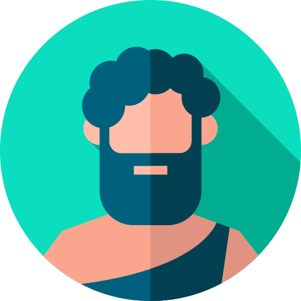

# Hercules

  

## About this agent

This is a fork of the [Poseidon](https://github.com/MythicAgents/poseidon) agent with a much smaller subset of commands available. This version is meant to be used as a base training agent for learning how to do Mythic agent and C2 development with regards to the Mythic side of things. The exercises for this workshop do not go into the agent side of development, but instead focus on how to make development easier on a windows host and how to interact with Mythic.

This agent was developed for Mythic 3.0.1 in June 2023 for use with the [Mythic Developer Workshop - Laying the Foundation](). It is *NOT* meant to be used in operations or anywhere outside of this workshop.

* [Exercise 0 - Install Mythic](/Workshop%20Exercises/Exercise%200.md)
* [Exercise 1 - Remote Agent Development](/Workshop%20Exercises/Exercise%201.md)
* [Exercise 2 - Create Initial Agent](/Workshop%20Exercises/Exercise%202.md)
* [Exercise 3 - Developing the Agent](/Workshop%20Exercises/Exercise%203.md)
* [Exercise 4 - Custom Message Formats](/Workshop%20Exercises/Exercise%204.md)
* [Exercise 5 - Custom C2](/Workshop%20Exercises/Exercise%205.md)