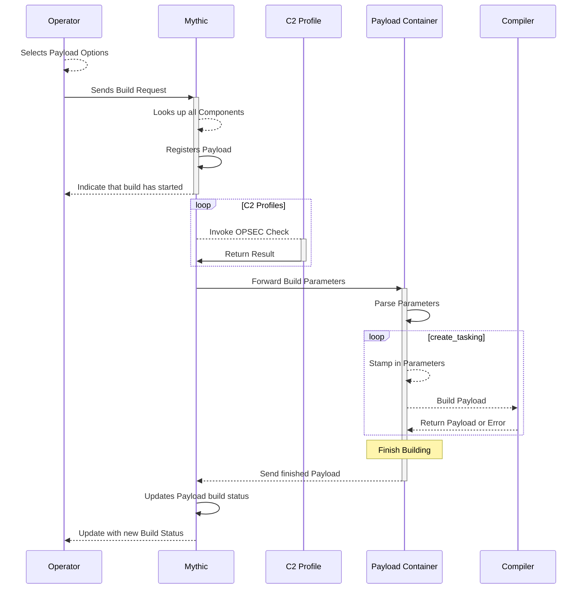

## Exercise 2 - Create Initial Agent 

### dev-desktop.lab
This sequence of events happens on the Windows `dev-desktop.lab` host.

Now we're going to build our initial agent. The general flow for building is captured [here](https://docs.mythic-c2.net/message-flow/building-payloads):



We select and pass in all of our build and c2 configurations which all comes down to the agent's `async def build(self) -> BuildResponse:` function.

This is where you can add agent code to your `agent_code` folder. 

### Faking out an agent

If you don't want to build an agent yet, but still want to see how it would look in the UI, we can use the UI to generate a new callback based on a payload we "create".

This is really handy for messing around with new commands within the UI since you don't have to actually build and execute an agent to start interacting with it.

1. `.\start_hercules_exercise2.ps1`

`hercules-Exercise2` has a few commands that we'll look at.

2. In Mythic, you should see a new agent called `hercules-exercise2`. Create a payload with this agent, then go to the payloads page and use the dropdown to create a new callback.

If you don't want to manually go through the process of creating a payload in the UI each time, we can script this out with the `mythic` PyPi package:

```python
import asyncio
import logging

from mythic import mythic


async def main():
    mythic_login_username = "mythic_administrator"
    mythic_login_password = "mythic_password"
    mythic_host = "mythic.lab"

    callback_host = f"http://{mythic_host}"
    callback_port = 80

    print(
        f"[*] Connecting to Mythic at {mythic_host} with username {mythic_login_username}"
    )
    mythic_instance = await mythic.login(
        username=mythic_login_username,
        password=mythic_login_password,
        server_ip=mythic_host,
        server_port=7443,
        logging_level=logging.WARNING,
    )

    # ################ Create a Payload ################
    print(
        f"[*] Creating hercules agent that will callback to {callback_host} on port {callback_port}"
    )
    resp = await mythic.create_payload(
        mythic=mythic_instance,
        payload_type_name="hercules-exercise2",
        filename="hercules.exe",
        operating_system="Windows",
        include_all_commands=True,
        c2_profiles=[
            {
                "c2_profile": "http",
                "c2_profile_parameters": {
                    "callback_host": callback_host,
                    "callback_port": callback_port,
                },
            }
        ],
        build_parameters=[
            {"name": "Architecture", "value": "AMD_x64"},
        ],
        return_on_complete=False,
    )
    print(resp)
try:
    asyncio.run(main())
except Exception as e:
    pass
```

### Creating a new command

Now let's make a new command, `shell`. Normally, the `shell` command really is just a specific way of running a program on disk (`/bin/bash`, `cmd.exe`, `PowerShell.exe`, etc) with specific arguments. 
So, we're going to create `shell` as a special kind of command that the agent doesn't actually know about. 

1. Make a new file called `shell.py` (or anything really, the name doesn't matter) in `hercules-Exercise2\agent_functions\`.
2. Add in the base class definitions:

```python
from mythic_container.MythicCommandBase import *
from mythic_container.MythicRPC import *
import shlex

class ShellArguments(TaskArguments):
    def __init__(self, command_line, **kwargs):
        super().__init__(command_line, **kwargs)
        self.args = []

    async def parse_arguments(self):
        pass


class ShellCommand(CommandBase):
    cmd = "shell"
    needs_admin = False
    help_cmd = "shell [command]"
    description = "Execute a shell command with 'bash -c' or 'cmd.exe /c'"
    version = 1
    author = "@xorrior"
    argument_class = ShellArguments
    attackmapping = ["T1059.004"]
    attributes = CommandAttributes(
        supported_os=[SupportedOS.MacOS, SupportedOS.Linux, SupportedOS.Windows],
        builtin=True,
        suggested_command=True,
    )

    async def create_go_tasking(self, taskData: MythicCommandBase.PTTaskMessageAllData) -> MythicCommandBase.PTTaskCreateTaskingMessageResponse:
        response = MythicCommandBase.PTTaskCreateTaskingMessageResponse(
            TaskID=taskData.Task.ID,
            Success=True,
        )
        return response

    async def process_response(self, task: PTTaskMessageAllData, response: any) -> PTTaskProcessResponseMessageResponse:
        resp = PTTaskProcessResponseMessageResponse(TaskID=task.Task.ID, Success=True)
        return resp
```

Notice how we have a `ShellArguments` class that subtasks `TaskArguments` and we have a `ShellCommand` class that subclasses the `CommandBase` class. 
We link these two together via the `ShellCommand`'s `argument_class` attribute. Right now this command doesn't take any `named` arguments - compare this to the `run` command that takes in a named `path` parameter and `args`. 

The real magic happens in the `create_tasking` function - once we return from this function, we're normally going to enter the `Submitted` state, which means an agent can check in and fetch the task. For us, we want to make sure that went the agent gets the task that it sees `run` rather than `shell` so we'll add the following line:

```python
response.CommandName = "run"
```

We should also make sure we adjust the parameters so that we properly call the `run` command. We can use the `taskData.args.add_arg` function to add additional arguments (and `taskData.args.remove_arg` to remove them if necessary). 
We also get access to a lot of contextual data through the `taskData` parameter. We can access our arguments through `taskData.args`, but we can also access callback information in `taskData.Callback`. 
For our `shell` command, we need to adjust the program we run based on if we're on Windows or Linux/macOS, so we need to see the selected OS when we built the payload:

3. Add in the following in the `create_tasking` function:
```python
passed_args = shlex.split(taskData.args.command_line)
if taskData.Payload.OS == "Windows":
    taskData.args.add_arg(
        "path", "C:\\Windows\\System32\WindowsPowerShell\\v1.0\\powershell.exe"
    )
    passed_args.insert(0, "/c")
else:
    taskData.args.add_arg("path", "/bin/bash")
    passed_args.insert(0, "-c")
taskData.args.add_arg("args", passed_args, type=ParameterType.Array)
response.DisplayParams = taskData.args.get_arg("path") + " " + " ".join(passed_args)
```

Here we add the `path` argument for `/bin/bash` or `Powershell` based on our payload's OS field. By default, when you add a new parameter it is of the `String` type. 
For `shell`, we'll want one `String` for the path, but then the rest of the arguments need to be passed in as an Array, so we'll need to set `type=ParameterType.Array`.

The last thing you'll notice is that we set the `DisplayParams` for the task. 
JSON is really handy for automation and computers, but not great when trying to quickly look over a list of tasks. 
So, you can adjust what the user actually sees to be something a bit cleaner. 
In this case, we simply set it to the path to the program followed by all the arguments.

In order to get this new command to exist in Mythic's interface, we need to stop our `python3 main.py` then start it up again.
